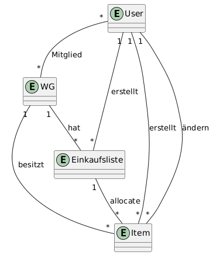

= Glossar: ShareShop
* Benjamin Banse Benjamin.Banse@stud.htw-dresden.de
* Kevin Bürger Kevin.Buerger@stud.htw-dresden.de
* Anni Nguyen Anni.Nguyen@stud.htw-dresden.de
* Emil Hempel Emil.Hempel@stud.htw-dresden.de
* Valencia Melvika Valencia.Melvika@stud.htw-dresden.de
* Florian Süßmann Florian.Suessmann@stud.htw-dresden.de
* Han Nguyen Han.Nguyen@stud.htw-dresden.de

{localdatetime}

include::../_includes/default-attributes.inc.adoc[]

== Einführung
Dieses Glossar erklärt die wichtigsten Begriffe der Einkaufslisten-App „ShareShop“ aus Sicht der Nutzer..

[#begriffe]
== Begriffe
[%header]
|===
| Begriff | Definition und Erläuterung | Synonyme

| Startseite
| Zentrale Übersicht mit folgenden Funktionen: Neue WG erstellen, WG auswählen, Einkaufslisten der ausgewählten WG anzeigen, Templates nutzen und neue Einkaufslisten erstellen..
| Übersicht, WG-Liste

| Einkaufsliste
| Liste mit Produkten, die eine WG gemeinsam einkaufen möchte.
|

| Vorlage
| Vorgefertigte Einkaufsliste, die wiederverwendet werden kann, um schnell neue Listen zu erstellen. Hilft Nutzern, häufig benötigte Items ohne manuelle Eingabe hinzuzufügen.
| Template, Liste-Vorlage

| Katergorie
| Gruppierung von Items, z.B. Obst, Getränke, Putzmittel
|

| Invite-Link
| Spezieller Link, der es neuen Mitgliedern ermöglicht, einer WG beizutreten
| Einladung, Beitrittslink

| QR-Code
|Visuelle Darstellung des Invite-Links als QR-Code. Mitglieder können den Code scannen, um schnell der WG beizutreten.
|

| Einkaufsmodus
| Sperrt die Einkaufsliste für andere, während jemand aktiv einkaufen ist. So werden Doppelkäufe vermieden.
|

| Verrechnen
| Funktion zum Abgleichen von Ausgaben, etwa bei geteilten Einkäufen oder Rechnungen.
|

| Rechnungen
| Seite, auf der Nutzer sehen, wie Ausgaben zwischen WG-Mitgliedern aufgeteilt wurden
| Ausgabenübersicht, Kostenübersicht

| Kalender
| Zeigt wichtige Termine oder wiederkehrende Einkaufsaktionen an
| Terminübersicht, Planungskalender

| Rezepte
| Sammlung von Kochanleitungen oder Rezeptideen, die in Einkaufslisten integriert werden können
| Kochanleitungen, Kochideen

| Produkt/Item
| Ein Eintrag innerhalb einer Liste mit Name, Kategorie, Menge und Preis.
| Artikel

| User
| Registrierter Benutzer mit E-Mail, Passwort und optionalem Namen.
| Benutzer, Nutzer

| WG
| Virtuelle Wohngemeinschaft, die gemeinsam Listen und Einkäufe verwaltet.
| Gruppe

| Änderungslog
| Chronologische Historie aller Aktionen auf Listen oder Items.
| Audit-Log

| Zuordnung
| Verbindung eines Items mit einer Einkaufsliste, inkl. Menge und Zeitpunkt.
| Allocation

|===

== Domänenmodell

