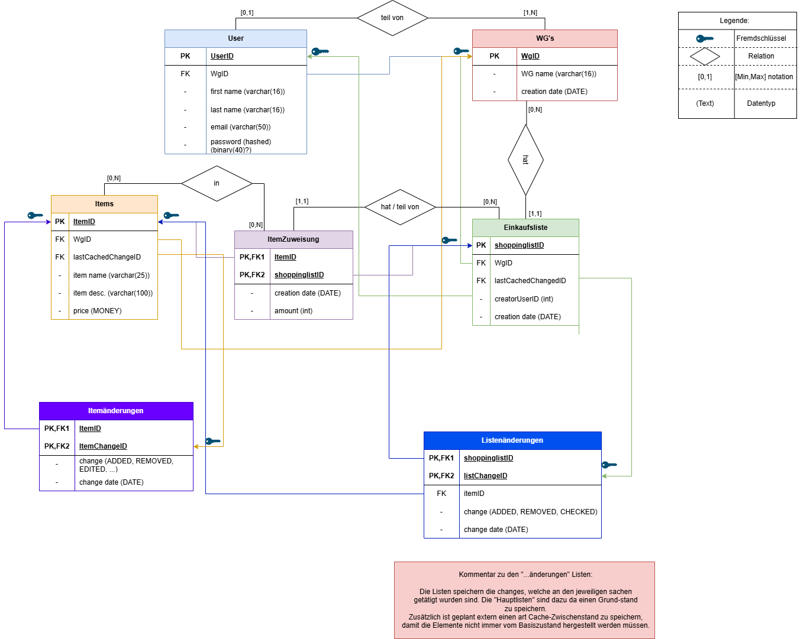

= Glossar: ShareShop
Kevin Bürger
{localdatetime}
include::../_includes/default-attributes.inc.adoc[]

== Einführung
In diesem Dokument werden die wesentlichen Begriffe aus dem Anwendungsgebiet der Einkaufslisten-App „ShareShop“ definiert. Zur besseren Übersichtlichkeit sind Begriffe, Abkürzungen und Datendefinitionen gesondert aufgeführt.

[#begriffe]
== Begriffe
[%header]
|===
| Begriff | Definition und Erläuterung | Synonyme

| Startseite
| Zentrale Übersicht mit WG-Auswahl, Listen, Templates und Möglichkeit zum Erstellen neuer Listen.
| Übersicht, WG-Liste

| Einkaufsliste
| Liste mit Produkten, die eine WG gemeinsam einkaufen möchte.
|

| Einkaufsmodus
| Sperrt die Einkaufsliste für andere, während jemand aktiv einkaufen ist. So werden Doppelkäufe vermieden.
|

| Verrechnen
| Funktion zum Abgleichen von Ausgaben, etwa bei geteilten Einkäufen oder Rechnungen.
|

| Item
| Ein Eintrag innerhalb einer Liste mit Name, Beschreibung und Preis.
| Artikel

| User
| Registrierter Benutzer mit E-Mail, Passwort und optionalem Namen.
| Benutzer, Nutzer

| WG
| Virtuelle Wohngemeinschaft, die gemeinsam Listen und Einkäufe verwaltet.
| Gruppe

| Änderungslog
| Chronologische Historie aller Aktionen auf Listen oder Items.
| Audit-Log

| Zuordnung
| Verbindung eines Items mit einer Einkaufsliste, inkl. Menge und Zeitpunkt.
| Allocation

|===

[#abkürzungenakronyme]
== Abkürzungen und Akronyme
[%header]
|===
| Abkürzung | Bedeutung | Erläuterung

| DB | Datenbank | Grundlage der persistenten Speicherung im Backend.
| ORM | Objektrelationaler Mapper | Übersetzt Java-Objekte in Datenbankeinträge.
| UUID | Universally Unique Identifier | 128bit eindeutige Kennung für Objekte wie User oder WG.
| CRUD | Create Read Update Delete | Grundlegende Operationen auf Ressourcen.
| cwd | current working directory | Aktuelles Arbeitsverzeichnis des Prozesses.
|===

[#verzeichnisdatenstruktur]
== Verzeichnis der Datenstrukturen
[%header]
|===
| Bezeichnung | Definition | Format | Gültigkeitsregeln | Aliase

| Anmeldedaten
| Zusammensetzung von Benutzername und Passwort.
| String
| E-Mail-Adresse muss `@`-Zeichen enthalten, Passwort gehashed.
| Login

| User
| Benutzer mit ID, Name, E-Mail und Passwort.
| JSON-Objekt
| Eindeutige UUID, Passwort gehashed, E-Mail eindeutig, .
| Nutzer, Benutzer

| WG
| Gruppe mit eindeutiger ID, Name und Erstellungsdatum.
| JSON-Objekt
| UUID eindeutig, Name max. 16 Zeichen.
| Wohngemeinschaft

| Einkaufsliste
| Liste von Items innerhalb einer WG.
| JSON-Objekt
| Muss WG zugeordnet sein, Creator-ID notwendig.
| Liste

| Item
| Produkt mit Namen, Beschreibung, Preis.
| JSON-Objekt
| Preis ≥ 0, Beschreibung optional.
| Artikel

| Item-Zuordnung
| Zuweisung eines Items zu einer Liste mit Menge.
| JSON-Objekt
| gültige Item- und Listen-ID.
| Allocation

| Änderung
| Repräsentiert eine Aktion wie Hinzufügen, Entfernen oder Abhaken.
| JSON-Objekt
| Muss gültigen Item- oder Listenkontext haben.
| Change-Log, Historie

| ID
| 128bit Identifikatoren für verschiedene Objekte.
| UUID, Stringdarstellung als URN
| Muss eine gültige UUID nach RFC4122 sein.
| Identifier
|===

== Domänenmodell

